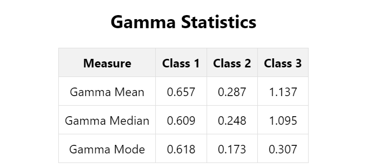

# Wine Statistics Project

This project provides tools to analyze wine data and calculate class-wise statistics for different attributes.

## Overview

The project includes the following functionalities:

1. Calculate class-wise mean, median, mode of "Flavanoids" attribute.
2. Calculate class-wise mean, median, mode of a custom attribute "Gamma" (calculated as Gamma = (Ash \* Hue) / Magnesium).

The "Class" is determined by the "Alcohol" property.

## Data Set

The data set used in this project can be found [here](https://drive.google.com/file/d/1td86FL0GyVYcKBUGY-8HX_wgeSDxWAsa/view).

## How to Run the Project Locally

To run the project locally, follow these steps:

1. Clone the Repository

    ```
    git clone https://github.com/rahuls24/data-visualization.git
    cd data-visualization
    ```

2. Install Dependencies using Yarn

    ```
    yarn install
    ```

3. Start the Project

    ```
    yarn start
    ```

    This will start the project and open it in your default web browser.

...

## Screenshots

### Statistics Table for "Flavanoids"


### Statistics Table for "Gamma"



## StackBlitz Demo

You can also try out the project on StackBlitz by following this link: [StackBlitz Demo](https://stackblitz.com/github/rahuls24/data-visualization)

## Dependencies

-   React
-   TypeScript
